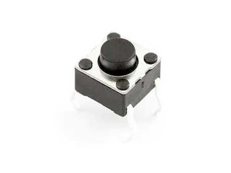

Buttons are tactile switches in a variety of sizes and shapes.

**Tutorial**: [{{page.link}}]({{page.link}}){:target="_blank"}

**Assignment**: Connect multiple buttons and control sounds, leds or motors with them.
