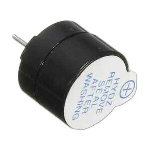

Buzzers are miniature speakers which you can use for playing melodies and other simple sounds.

**Tutorial**: [{{page.link}}]({{page.link}}){:target="_blank"}

**Assignment**: Play tones based on sensor input.
