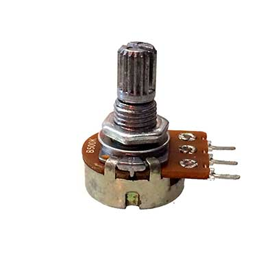

A Potentiometer is a variable resistor. It usually has three pins. The centre pin is often called the wiper and will move from the first pin to the last. By reading the value form the centre pin you can 'slide' along a scale.

**Tutorial**: [{{page.link}}]({{page.link}}){:target="_blank"}

**Assignment**: Connect multiple potentiometers and control sounds, leds or motors with them or display the value on a lcd display.
