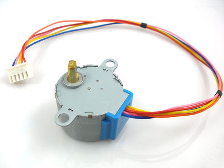

Stepper motors fall somewhere in between a regular DC motor and a servo motor. They have the advantage that they can be positioned accurately, moved forward or backwards one 'step' at a time, but they can also rotate continuously.

**Tutorial**: [{{page.link}}]({{page.link}}){:target="_blank"}

**Assignment**: Control the direction, amount of steps and speed with sensors.
